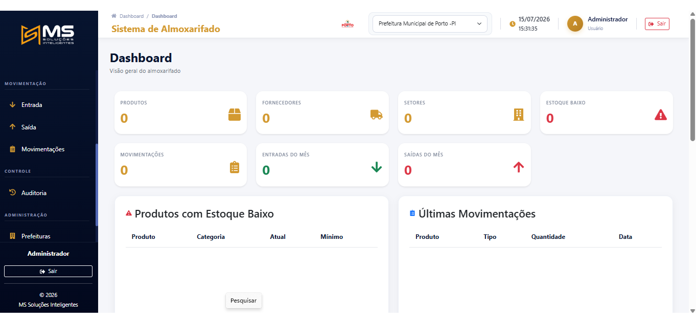
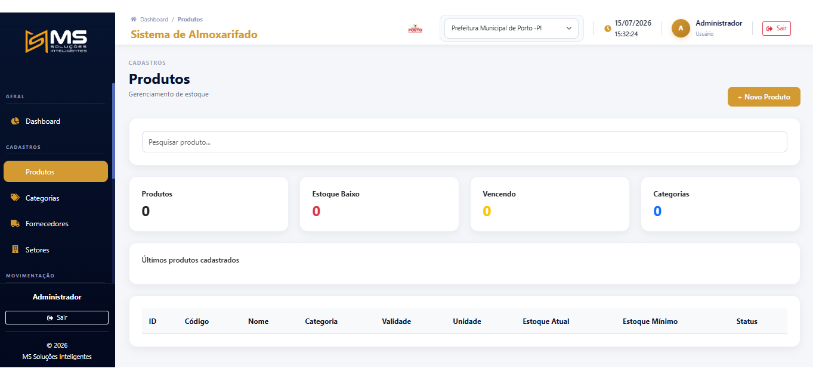
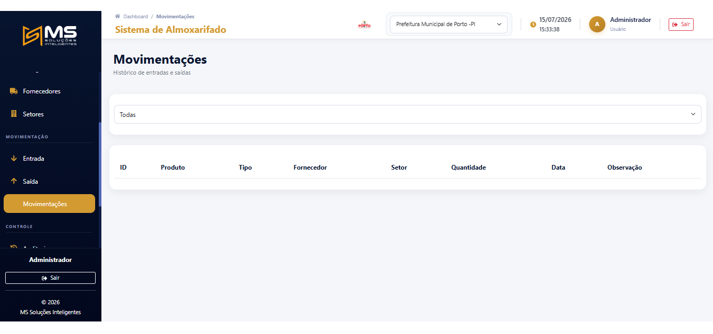

<p align="center">


</p>

<h1 align="center">

MS Almoxarife

</h1>

<p align="center">

Sistema Inteligente de Gestão de Almoxarifado Público

</p>

<p align="center">

Desenvolvido pela <b>MS Soluções Inteligentes</b>

</p>


\# Sobre o projeto


O MS Almoxarife foi desenvolvido para informatizar e modernizar o controle de almoxarifados municipais.


O sistema permite controlar entradas, saídas, estoque, lotes, fornecedores, usuários, setores e auditoria completa das movimentações.


Foi projetado para atender Prefeituras, Câmaras Municipais, Autarquias e demais órgãos públicos.


\---


\# Funcionalidades


\- Cadastro de Produtos

\- Cadastro de Categorias

\- Cadastro de Fornecedores

\- Cadastro de Setores

\- Cadastro de Usuários

\- Cadastro de Prefeituras

\- Controle de Estoque

\- Controle por Lotes

\- Entrada de Produtos

\- Saída de Produtos

\- Dashboard Inteligente

\- Auditoria de Movimentações

\- Relatórios

\- API REST

\- Autenticação JWT


\---


---

## Tecnologias


---
# Telas do Sistema

## Login


---

## Dashboard



---

## Produtos



---

## Movimentações




\# Estrutura


```

backend/

frontend/

docs/

scripts/

backups/

```


\---


\# Instalação


Clone o projeto


```bash

git clone https://github.com/Juniorjoelpt/sistema-almoxarifado.git

```


Entre na pasta


```bash

cd sistema-almoxarifado

```


Suba os containers


```bash

docker compose up -d --build

```


\---


\# Atualização


```bash

git pull origin main


docker compose up -d --build

```


\---


\# Backup


Os procedimentos completos estão disponíveis em:


```

docs/backup.md

```


\---


\# Deploy


Documentação:


```

docs/deploy.md

```


\---


\# Licença


Projeto desenvolvido pela \*\*MS Soluções Inteligentes\*\*.


Todos os direitos reservados.


